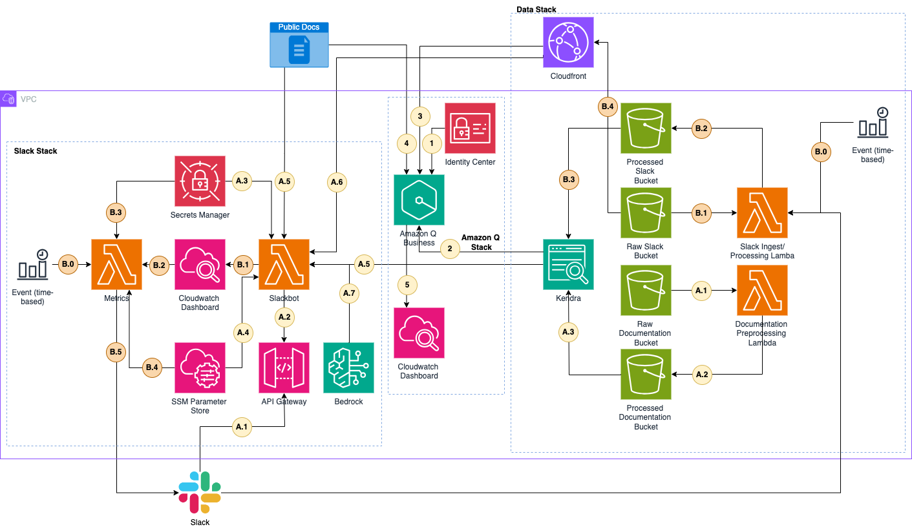

# Multi-interface chatbot using Amazon Q and Slack with CloudFront clickable sources 

## Introduction:
This application is an AI-powered chatbot designed to help users navigate and utilize the [Spack package manager tool](https://spack.io/). 
This innovative chatbot that employs Retrieval-Augmented Generation (RAG) technology to provide responses 
to user queries and can be interacted with both in Slack and Amazon Q. This solution can be applied to a variety of 
use cases that require knowledge integration to a chatbot. The two main selling points of this solution is: 
(1) having the ability to interact with the chatbot in two mediums and (2) being able to show sources in websites and 
documents in an S3 bucket via CloudFront.

## Notable Features:
* Slackbot and Amazon Q both share the same vector database reducing solution complexity and cost.
* Both Slackbot and Amazon Q bot provides clickable links to its sources for generating answers in their responses:
  * https://spack-tutorial.readthedocs.io/en/latest/index.html
  * Text files (`docuemnts/slack/*.txt`) uploaded to S3 bucket via CloudFront distribution
* Automated updates of both data sources.
* Dashboard for tracking bot invocations for Slack and Amazon Q:
  * Aws Console -> Amazon Q Business -> Radiuss -> Analytics dashboard
  * Aws Console -> Cloudformation -> Stacks -> SlackStack -> Outputs -> AmazonQCloudwatchDashboardOutput

## Architecture:


### Stacks:
* Data Stack:
  * A) Documentation Data
    1. `Documentation Processing Lambda` pulls in data from `Raw Documentation Bucket` and does the following:
       * Converts `.rst` files into markdown. 
       * Splits the markdown text based on its title
       * Generates [metadata files](https://docs.aws.amazon.com/kendra/latest/dg/s3-metadata.html) that will be used by kendra. The metadata files contains the following attributes:
         * title: section title from data split 
         * data_source: `documentation`
         * _source_uri: URL from the documentation which is `https://spack.readthedocs.io/en/latest/` + file name + "#" + section title  
    2. `Documentation Processing Lambda` saves the split markdown and the metadata files into `Processed Documentation Bucket`.
    3. `Documentation Processing Lambda` triggers a kendra data source sync job to crawl the `Processed Documentation Bucket`.
  * B) Slack Data
    Slack Processing Lambda:
    1. `Slack Processing Lambda` pulls in data from `Raw Slack Bucket` which contains historical Slack data and does the following:
       * Generates [metadata files](https://docs.aws.amazon.com/kendra/latest/dg/s3-metadata.html) that will be used by kendra. The metadata files contains the following attributes:
         * title: section title from data split 
         * data_source: `slack`
         * _source_uri: generated CloudFront URL from the `Raw Slack Bucket`
    2. `Slack Processing Lambda` saves historical slack data and the metadata files into `Processed Slack Bucket`.
    3. `Slack Processing Lambda` triggers a kendra data source sync job to crawl the `Processed Slack Bucket`.
    4. `Raw Slack Bucket` data is passed into a CloudFront distribution for public access.
    Slack Ingest Lambda:
    0. `Slack Ingest Lambda` is triggered by event bridge daily.
    1. `Slack Ingest Lambda` pulls in the past 24 hours conversation from slackdata from slack and writes it to Raw slack data
    2. `Slack Ingest Lambda` saves conversation data into `Processed Slack Bucket` together with its metadata.
    3. `Slack Processing Lambda` triggers a kendra data source sync job to crawl the `Processed Slack Bucket`.
    4. `Processed Slack Bucket` data is passed into a CloudFront distribution for public access.
  
* Amazon Q Stack: [Amazon Q Business](https://docs.aws.amazon.com/amazonq/latest/qbusiness-ug/what-is.html) is a fully managed, 
generative-AI powered assistant tailored for this use case to answer questions based on the data from the data stack.
1. `Identity Center` - Provides authentication to Amazon Q.
2. `Kendra` provides context to the responses via semantic search and sources.
3. `Cloudfront` links are provided by kendra and propagates to the responses of Amazon Q.
4. `Public Docs` links are provided by kendra and propagates to the responses of Amazon Q.
5. Invocations are logged in a `Cloudwatch` Dashboard.

* Slack
  * A) Answering Questions
    1. Slack app invokes `API Gateway` with the question as a part of the payload. 
    2. `API Gateway` invokes `Slackbot Lambda`.
    3. `Slackbot Lambda` pulls Slack token from `Secrets Manager`.
    4. `Slackbot Lambda` pulls Slack parameters for responses from `SSM Parameter Store`.
    4. `Kendra` is queried with the question and responds with relevant passages and sources from documentation and slack data from `Cloudfront`.
    5. Public docs are returned as part of the response if the chatbot used it as a source.
    6. Slack data via `Cloudfront` are returned as part of the response if the chatbot used it as a source.
  * B) Reporting
    0. `Metrics Lambda` is triggered every day at 0:00 UTC
    1. Everytime the `Slackbot Lambda` is triggered it is captured in `Cloudwatch` as a metric.
    2. `Metrics Lambda` pulls daily data from `Cloudwatch`
    3. `Metrics Lambda` pulls Slack token from `Secrets Manager`
    4. `Metrics Lambda` pulls slack parameters for responses from `SSM Parameter Store`
    5. `Metrics Lambda` send message on slack with daily report

## Deploying the Solution:
### Requirements:
 * Active AWS account
 * Docker
 * [AWS CLI](https://docs.aws.amazon.com/cli/latest/userguide/getting-started-install.html)
 * [Slack workspace](https://slack.com/help/articles/206845317-Create-a-Slack-workspace)
   * `Parent Channel`: Public [Slack Channel](https://slack.com/help/articles/201402297-Create-a-channel) where users will be interacting with the slack chatbot.
   * `Child Channel`: Private [Slack Channel](https://slack.com/help/articles/201402297-Create-a-channel) where metrics report will be sent to.
 * If building from an arm based machine (Apple M series) change the parameter for `architecutre` in `documentation_processing_lambda` in `stacks/data.py` to `lambda_.Architecture.ARM_64`. 

### Step 1: Account Set-up
 * Ensure [Bedrock model access](https://docs.aws.amazon.com/bedrock/latest/userguide/model-access-modify.html) for `anthropic.claude-v2:1`
 * Enable [IAM identify Center](https://docs.aws.amazon.com/singlesignon/latest/userguide/get-set-up-for-idc.html) for your account.

### Step 2: Install project dependencies
```bash
pip install -r requirements.txt
```

### Step 3: Bootstrap Account (Skip if done previously)
```bash
cdk bootstrap
```

### Step 4: Synthesize CDK App
```bash
cdk synth
```

### Step 5: Deploy AWS infrastructure
```bash
cdk deploy --all
```

### Step 6: Slack Set-up
1. Create a Slack app: 
* Go to: https://api.slack.com/apps 
* Select `Create an App`
* Select `From a manifest`
  1. Select `Spack` workspace 
  2. Select `YAML` tab and copy the contents of the [app manifest](spackbot_manifest.yml) and select `Next` 
  3. Select `Create`

2. Install App
 * On the left pane, under settings select `Install App`
 * Select `Install to <workspace>`
 * Select `Allow`

3. Copy Bot User OAuth Token


* Go to: AWS Console -> AWS Secrets Manager -> Secrets -> SlackAccessKey### -> Overview -> Retrieve Secret Value -> Edit
* Paste value where it says `place-holder-access-key`
* Click `Save`

4. Enter endpoint (One app is finished deploying from Step 1) 
* Got to: AWS Console -> Cloudformation -> Stacks -> SlackStack -> Outputs -> SlackBotEndpointOutput (copy Value)
* Enable events


* Paste value under `Request URL`


* On the bottom right of the screen select `Save Changes`

5. Invite bot to channels (Parent and Child):
* Select the channel
* On the upper right next to huddle click on the three dots.
* Select `edit settings`
* Go to `integrations` tab
* Select `Add an app`
* Under the `In your workspace` tab select add the chatbot

6. Enter Slack workspace information:

Obtain the following information from slack:
* Parent channel ID
* Child channel ID

Note: To obtain channel id, right-click the channel -> View Channel Details -> About -> Copy channel ID
* Slackbot member ID: Under apps -> right-click the bot -> view app details -> Copy Member ID. If Slack bot is not under apps, click `Add apps` and select the slackbot.

Enter above information into AWS:
* Got to: AWS Console -> Systems Manager -> Application Management -> Parameter Store -> My parameters
* Select `/Radiuss/Spack/ChildChannelId` and edit. Enter the child channel id as the value and select `save changes`
* Select `/Radiuss/Spack/ParentChannelId` and edit. Enter the parent channel id as the value and select `save changes`
* Select `/Radiuss/Spack/SlackbotMemberId` and edit. Enter the Slackbot member id as the value and select `save changes`

Security: It is highly recommended that the user change the slack token periodically.

### Step 7: Adding users to Amazon Q
* Go to AWS Console -> Amazon Q Business -> Applications -> Radiuss -> User Access -> Manage user access
* Select `Add groups and users`
* Select `Add and assign new users`
* Select `Next`
* Enter information
* Select `Next`
* Select `Add`

#### Upgrade/Downgrade user subscription
* Go to AWS Console -> Amazon Q Business -> Applications -> Radiuss -> User Access -> Manage user access
* Select user via radio button
* Select `Edit subscription`
* Select `Choose subscription` from dropdown
Subscription tiers are available in this [link](https://aws.amazon.com/q/business/pricing/)

## Accessing the applications:
* `Amazon Q`: AWS Console -> Amazon Q Business -> Applications -> Radiuss -> Web experience settings -> Deployed URL
* `Slack`: Workspace -> Designated Channel -> Send a single message that starts with @SpackChatbot

# Authors and Reviewers:
 * Nick Biso, Machine Learning Engineer - Amazon Web Services Inc.
 * Ian Lunsford, Aerospace Cloud Consultant - Amazon Web Services Inc.
 * Natasha Tchir, Machine Learning Engineer - Amazon Web Services Inc.
 * Katherine Feng, Machine Learning Engineer - Amazon Web Services Inc.

## Security

See [CONTRIBUTING](CONTRIBUTING.md#security-issue-notifications) for more information.

## License

This library is licensed under the MIT-0 License. See the LICENSE file.

